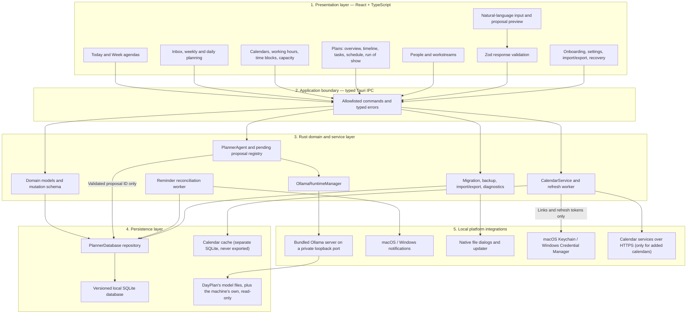
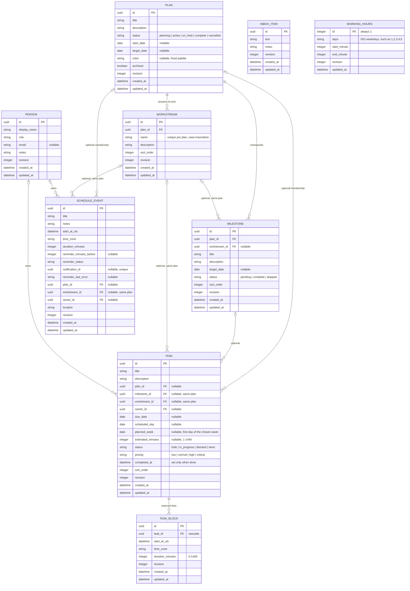
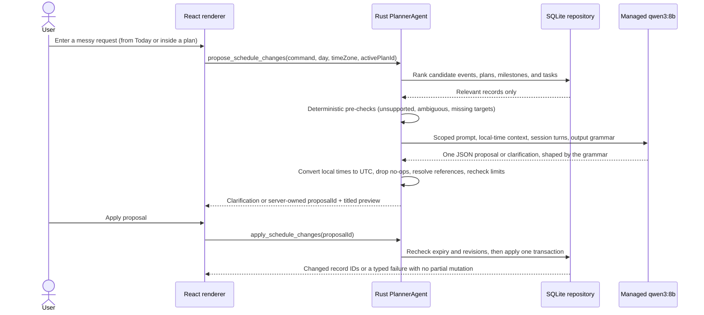

# DayPlan — Local AI Desktop Planner

DayPlan is a local-first planner for macOS and Windows that turns plans into days. It connects long-range plans—launches, charity streams, trips, research projects—to what actually has to happen this week and today. It combines plans with milestones, workstreams, owners, and tasks; a Today agenda and a Week view with read-only Google, Outlook, and other calendars beside them; time blocks and planned-versus-available capacity; a run of show for event days; per-event reminders; recovery tools; and a natural-language planner that turns messy requests into reviewed changes.

> “Move gym to 6pm tomorrow, mark Book venue done, and add a Rent cameras task to Charity Week due October 9.”

The important engineering idea is the permission boundary, not the chat box: the model never receives a database handle and cannot write planner data. It may only return one schema-constrained proposal or one clarification question. DayPlan validates the response, presents a readable preview, and mutates SQLite only after explicit user confirmation.

## What the app includes

| Area            | What it does                                                                                  | Where it runs                                           |
| --------------- | --------------------------------------------------------------------------------------------- | ------------------------------------------------------- |
| Today and Week  | Timed events, overlapping events, scheduled and due tasks, milestones, plan filter            | React renderer + Rust repository                        |
| Capture         | An Inbox for unorganized thoughts, converted into tasks, plans, or events later               | React renderer + Rust repository                        |
| Planning        | Weekly and daily planning sessions, estimates, and carry-forward of unfinished work           | React renderer + Rust repository                        |
| Calendars       | Read-only Google, Outlook, iCalendar link, and `.ics` calendars, refreshed while DayPlan runs | Rust `CalendarService` + separate cache                 |
| Time & capacity | Time blocks for tasks, working hours, and planned work against available time                 | React renderer + Rust repository                        |
| Plans           | Overview with attention signals, timeline, filtered tasks, schedule, run of show              | React renderer + Rust repository                        |
| Teams           | Workstreams inside a plan and people who own tasks and events                                 | React renderer + Rust repository                        |
| Manual planning | Creates, edits, and deletes plans, milestones, tasks, and events with revision checks         | Typed Tauri commands + Rust transactions                |
| AI planner      | Converts natural language into a preview of permitted event, plan, and task changes           | Local Ollama, any installed model + Rust `PlannerAgent` |
| Reminders       | Stores one optional reminder per event and retries interrupted delivery                       | SQLite outbox + native notification plugin              |
| Data safety     | Migrates, checks, backs up, exports, imports, and restores local data                         | Rust + SQLite                                           |
| Distribution    | Produces macOS and Windows installers; signed builds add user-approved updates                | GitHub Actions + Tauri updater                          |

The desktop edition is single-device and requires no account, API key, hosted backend, or cloud AI. The earlier SwiftUI / SwiftData / WidgetKit app remains available on the [`ios-swiftui`](https://github.com/Von-Van/DayPlan/tree/ios-swiftui) branch; its data is intentionally separate.

## Layered architecture

The renderer is intentionally the least-trusted application layer. It can request actions and display previews, but persistence, AI lifecycle, proposal ownership, validation, and native integrations remain in Rust.



### Layer responsibilities

| Layer          | Owns                                                                                                                          | Explicitly does not own                                              |
| -------------- | ----------------------------------------------------------------------------------------------------------------------------- | -------------------------------------------------------------------- |
| React renderer | Interaction state, forms, previews, accessibility, strict public-response parsing                                             | SQL, model processes, proposal operations, secrets, filesystem paths |
| Tauri IPC      | A narrow command surface, argument serialization, typed error responses                                                       | Business decisions or direct database queries                        |
| Rust services  | Validation, time-zone handling, AI context, proposal/session state, calendar fetching and parsing, capacity, native workflows | Presentation state                                                   |
| Repository     | Transactions, revisions, migrations, integrity checks, backups, reminder outbox                                               | Natural-language interpretation                                      |
| Ollama runtime | Local inference for the chosen installed model                                                                                | Database access, cloud fallback, application updates                 |

### Repository map

| Path                                                                   | Responsibility                                                                                                                       |
| ---------------------------------------------------------------------- | ------------------------------------------------------------------------------------------------------------------------------------ |
| [`src/`](src/)                                                         | React views, interaction state, accessibility, styling, and strict frontend schemas                                                  |
| [`src/api.ts`](src/api.ts)                                             | Typed renderer-facing command client and Zod response boundary                                                                       |
| [`src/planning.ts`](src/planning.ts)                                   | Pure plan signals and planning sessions: attention, timeline, run of show, week, moves                                               |
| [`src/proposals.ts`](src/proposals.ts)                                 | Readable previews of AI proposal operations                                                                                          |
| [`src/calendars.ts`](src/calendars.ts)                                 | Agenda items from events, time blocks, and calendars; capacity and working-hours labels                                              |
| [`src-tauri/src/lib.rs`](src-tauri/src/lib.rs)                         | Tauri application composition, IPC commands, native plugins, tray, and reminder worker                                               |
| [`src-tauri/src/model.rs`](src-tauri/src/model.rs)                     | Domain records, AI mutation union, proposal types, and shared limits                                                                 |
| [`src-tauri/src/db.rs`](src-tauri/src/db.rs)                           | SQLite repository, transactions, migrations, backups, imports, and reminder outbox                                                   |
| [`src-tauri/src/db/planning.rs`](src-tauri/src/db/planning.rs)         | Plan, milestone, and task repository: validation, revisions, archive and delete rules                                                |
| [`src-tauri/src/db/team.rs`](src-tauri/src/db/team.rs)                 | People and workstreams: link validation and detach-on-delete rules                                                                   |
| [`src-tauri/src/db/capture.rs`](src-tauri/src/db/capture.rs)           | The Inbox: captures and one-transaction conversion into tasks, plans, and events                                                     |
| [`src-tauri/src/db/horizons.rs`](src-tauri/src/db/horizons.rs)         | Weekly and daily planning data and batched moves between plan, week, and day                                                         |
| [`src-tauri/src/db/proposals.rs`](src-tauri/src/db/proposals.rs)       | AI candidate ranking and atomic, revision-checked proposal application                                                               |
| [`src-tauri/src/db/availability.rs`](src-tauri/src/db/availability.rs) | Time blocks, working hours, and the planner facts capacity is computed from                                                          |
| [`src-tauri/src/calendar.rs`](src-tauri/src/calendar.rs)               | Read-only calendars: connecting, subscribing, importing, refreshing, and removing                                                    |
| [`src-tauri/src/calendar/`](src-tauri/src/calendar/)                   | iCalendar reading, link fetching, read-only OAuth and provider APIs, keychain-held links and tokens, and the separate calendar cache |
| [`src-tauri/src/capacity.rs`](src-tauri/src/capacity.rs)               | Working time, busy time, free time, and planned work for a window of days                                                            |
| [`src-tauri/src/agent.rs`](src-tauri/src/agent.rs)                     | Planner session, pending proposals, and the local model request                                                                      |
| [`src-tauri/src/agent/`](src-tauri/src/agent/)                         | Prompts and output grammar, deterministic pre-checks, and reply resolution                                                           |
| [`src-tauri/src/runtime.rs`](src-tauri/src/runtime.rs)                 | Bundled Ollama process, private endpoint, installed-model discovery, downloads, diagnostics, and start/stop lifecycle                |
| [`eval/`](eval/)                                                       | Hand-labeled commands and machine-readable evaluation results                                                                        |

## Core data schema



Every record is revisioned so manual edits and AI proposals can detect stale data. Times are persisted in UTC alongside their IANA time zone. Reminder offset, status, internal notification ID, and retry error are columns on the event itself; together they form the transactional reminder outbox that startup reconciliation processes.

A `Plan` is a long-range container and may exist without dates. Items without a plan remain fully valid, so DayPlan still works as a plain day planner. A `Milestone` is a checkpoint rather than work; only user decisions (`pending`, `complete`, `skipped`) are stored, and "upcoming" or "overdue" are derived from dates. A `Task` is work that needs doing, kept separate from `ScheduleEvent` (a block of time). A task no longer needs a calendar day: it can live inside a plan, be chosen for a week without a day yet, be scheduled onto a day, or be due by a day, but it must have at least one of those so it always appears somewhere. `planned_week` holds the first day of the chosen week and is matched by range, so a changed week start never orphans a choice; a due date never implies a week or a day. A task can also carry an optional estimate. A task's milestone and workstream must belong to the task's plan. The Today view lists tasks scheduled for the selected day plus tasks due that day and milestones on that day; the Week view shows the same for seven days, with the week's no-day tasks above. Both can be filtered by plan. Task reminders remain outside the current scope.

The Inbox holds `InboxItem` captures that need no plan, date, or priority, from its own screen or from anywhere with ⌘I (Ctrl+I on Windows). Converting an item creates a task, plan, or event and removes the item in one transaction. Weekly planning shows work left from earlier weeks, overdue and soon-due tasks, tasks behind upcoming milestones, and each active plan's unscheduled backlog beside the week's chosen work and estimates. Daily planning builds today from unfinished, due, and chosen work. Today offers each session in a quiet prompt until it is planned or dismissed, and lists open tasks whose scheduled day has passed so they can be moved on explicitly; nothing is rescheduled automatically. Every move between a plan, a week, and a day changes the same task record, and a batch of moves applies in one revision-checked transaction.

A `TaskBlock` reserves time on the calendar for a task, apart from events. A task can have several blocks; moving or removing a block never changes the task, deleting the task deletes its blocks, and a finished task can't take a new one. When a task is finished, Today offers to release its future blocks and keeps past ones. `WorkingHours` is one revision-checked record of working days and hours (Monday–Friday, 09:00–17:00 by default). Capacity compares the estimates of open tasks scheduled on a day, plus a week's no-day choices, with the time working hours leave after DayPlan events and busy events from visible calendars; blocks narrow the free time the block dialog suggests but aren't subtracted twice. DayPlan shows "Planned 17 h, available 11 h" on Today, Week, and both planning sessions and never moves anything because of it.

Calendars from other apps are read-only and live outside the planner database. Connecting a Google or Outlook account signs in through the system browser with PKCE and read-only scopes, then asks which of that account's calendars to show; the refresh token goes to the keychain and disconnecting revokes it. Subscribing to an https or webcal link (such as Google's secret iCal address or an Outlook published calendar) fetches and checks it first; an imported `.ics` file changes only when a newer file replaces it. Accounts and links refresh every 30 minutes while DayPlan runs. Recurring events are expanded from 6 weeks back to 400 days ahead, with moved and cancelled occurrences, Windows and vendor time-zone names, and Outlook busy status handled. Their events appear on Today and Week in a distinct style, count toward busy time unless marked free or hidden, and are never editable, exported, or seen by the planner. [CALENDAR_SYNC.md](CALENDAR_SYNC.md) describes the design, and [CALENDAR_ACCOUNTS.md](CALENDAR_ACCOUNTS.md) covers the OAuth clients behind the account connections.

A `Workstream` is a named stream of work inside one plan, such as Production or Sponsors, with progress derived from its tasks. A `Person` is a local label for whoever owns a task or event—never an account. Deleting a workstream or person keeps their work and clears the link, advancing revisions. A plan's run of show lists one day's events in order with owners, locations, live/next status, gaps, and overlaps.

Archiving is the normal way to put a plan away; it hides the plan from navigation and keeps everything. A plan must be archived before it can be deleted permanently. Deletion runs in one transaction and is previewed in the confirmation: the plan's workstreams, milestones, and tasks with no week, scheduled day, or due date are deleted, while its other tasks and all of its events stay on the calendar without a plan or workstream (their revisions advance). Owners stay assigned. Deleting a milestone keeps its tasks in the plan.

AI proposals are not database records. They live only in memory, expire after ten minutes, and contain up to twelve operations from a closed union of event, plan, milestone, and task operations (listed below).

## How an AI command moves through the system



## AI permission boundary

The renderer cannot submit invented mutations. `PlannerAgent` keeps one pending proposal per in-memory session for ten minutes. Applying accepts only its opaque `proposalId`; the Rust layer retrieves the validated operations, rechecks IDs and revisions, and consumes the proposal after one attempt. Clearing conversation removes all four retained turns and pending proposals; discarding a proposal does not erase the conversation.

The only permitted operations are:

| Operation          | Typed fields                                                                                           |
| ------------------ | ------------------------------------------------------------------------------------------------------ |
| `create_event`     | title, notes, UTC start, IANA time zone, duration, optional reminder offset, optional plan             |
| `update_event`     | event ID + revision, optional title/notes/duration, typed reminder change                              |
| `delete_event`     | event ID + revision                                                                                    |
| `reschedule_event` | event ID + revision, UTC start, IANA time zone, optional title/notes/duration, typed reminder change   |
| `set_event_plan`   | event ID + revision, plan or none                                                                      |
| `create_plan`      | title, description, status, optional start and target dates                                            |
| `update_plan`      | plan ID + revision, optional title/description/status/dates                                            |
| `create_milestone` | plan, title, description, optional target date                                                         |
| `update_milestone` | milestone ID + revision, optional title/description/target date/status                                 |
| `delete_milestone` | milestone ID + revision (its tasks stay in the plan)                                                   |
| `create_task`      | title, description, optional plan and milestone, optional scheduled day and due date, status, priority |
| `update_task`      | task ID + revision, optional title/description/status/priority, typed estimate change                  |
| `schedule_task`    | task ID + revision, typed scheduled-day, due-date, and planned-week changes                            |
| `set_task_plan`    | task ID + revision, plan or none, optional milestone                                                   |
| `delete_task`      | task ID + revision                                                                                     |

A plan or milestone reference is either an existing ID or the title of a plan or milestone created earlier in the same proposal, so “start a Bake sale plan and add a Buy flour task to it” is one reviewable change. Plans and milestones are created first when a proposal applies.

Each suggestion is reviewed on its own. Every one carries a handle and the handles of the suggestions it can't be applied without, so rejecting a plan also rejects the task that was going to live in it. Applying sends only the accepted handles; Rust refuses a selection that leaves a dependency behind, and the accepted set commits in one transaction. A selection that would strand a task — taking it out of its plan without the day a rejected suggestion would have given it — is refused by the same rule that governs manual edits, before anything is written. A proposal is spent once it has been answered, whether all or part of it applied.

`create_task`, `update_task`, and `schedule_task` may also carry a one-line `reason` for a choice the request didn't make, shown under the suggestion. The planner picks a day, due date, or week itself only when the request asks it to (“when should I…”, “find time for…”, “plan my week”), and those are labelled **suggested** in the review. Otherwise an invented date is still dropped or turned into a question.

The model answers through Ollama structured outputs: DayPlan sends a JSON Schema that Ollama compiles into a decoding grammar, so a reply cannot contain unknown operations or fields, and ID fields accept only the IDs of records in that request's context. The model writes local wall-clock times; Rust converts them to UTC and asks a question when a time is duplicated or skipped by a DST change. Rust then deserializes the reply with `deny_unknown_fields`, drops values that equal the current ones, resolves titles for new plans and milestones, checks that milestones belong to the task's plan and that every task keeps a plan, scheduled day, or due date, and validates the result again before it can enter the pending-proposal registry. Values the request never states are dropped or become a question: an invented day or length, or a plan, milestone, or task the user did not name, viewed, or touch earlier in the session. A follow-up such as “rename it too” merges into the proposal still awaiting review instead of silently replacing it. React validates the public response with strict Zod schemas and shows each operation with the titles of the records it touches.

Ambiguous titles (including duplicate task, milestone, and plan names), missing targets and dates, deleted records, bare 12-hour times such as `at 2`, DST gaps and overlaps, recurrence, task reminders, deleting or archiving plans, assigning people, workstreams, locations, requests that address the model's instructions or name its internal operations, and contradictory compound requests produce a clarification.

AI context is intentionally small. Requests that do not mention plans, tasks, or their titles use the original event-only prompt and see only events. Planning requests also see open plans, and only the milestones and tasks that match the request, belong to a plan the request names or the plan being viewed, were referenced earlier in the session, or fall on the selected day. Event notes, task and plan descriptions, people, and workstreams are never sent, and conversation state is not persisted.

## Storage, recovery, and privacy

The current database schema is version 6. Existing databases are backed up and migrated transactionally: schema 3 adds `plans` and `milestones`, gives events a nullable `plan_id`, and moves every day-bound task into the general `tasks` table with `scheduled_day` set to its old day and a `done` or `todo` status from its completion state; schema 4 adds `people` and `workstreams`, owner and workstream links, and event locations; schema 5 adds `inbox_items` and each task's `planned_week` and `estimated_minutes`; schema 6 adds `task_blocks` and the `working_hours` record. Restoring an older backup migrates it the same way when it opens. SQLite foreign keys are enforced. Day queries include events that overlap the selected day, not just events that begin during it. Manual edits atomically update every editable field under one revision check.

Settings offers:

- strict, versioned JSON export (format 6 includes people, plans, workstreams, milestones, events, tasks, inbox items, and time blocks; formats 1–5 still import, with day tasks upgraded the same way as the migration and every cross-record link checked before anything is replaced; working hours and calendars aren't exported);
- import preview and explicit confirmation before replacement;
- automatic backup before import and recovery from the five retained backups;
- model/version diagnostics;
- a private diagnostic ZIP generated only on request; and
- manual update checks.

Rotating local logs retain five 512 KB files. DayPlan does not log commands, plan/milestone/event/task titles, names, emails, notes, descriptions, proposal contents, calendar names, links, or events, or database paths. Diagnostic bundles contain only version/health metadata (including a calendar count and problem codes) and those redacted logs.

DayPlan contacts a calendar service only for calendars you add, and only from Rust; it never uploads planner data. Every request it makes to Google or Microsoft is a `GET`, and it asks for read-only scopes, so it can't change, create, or delete anything in your calendars. Calendar links and OAuth refresh tokens grant read access, so each one is stored in the macOS Keychain or Windows Credential Manager and never in SQLite, exports, backups, logs, or the renderer, which only sees the link's host and the connected account's name. Cached calendar events, the last fetched document, and sync state live in `calendars.sqlite3`, apart from the planner database: backups, restores, and imports don't touch it, and removing a calendar deletes everything cached for it along with its link. Because macOS ties keychain access to the app's signature, unsigned builds ask again for access to each calendar's link and each account's token after an update. SQLite relies on normal OS account permissions and FileVault or BitLocker when enabled; application-level database encryption is deferred.

## Event reminders

An event can have one reminder from its start time through seven days beforehand. The UI includes presets for start, 5, 10, 15, 30, and 60 minutes, plus one day. AI operations use either `reminderMinutesBefore` or a typed `ReminderChange` (`unchanged`, `clear`, or `set`). Rescheduling retains the offset unless explicitly changed, deleting cancels it, and imports generate new internal notification IDs.

Desired reminder state and the retryable outbox are stored in the same SQLite transaction as the event. Notifications contain the event title and localized start time—never notes. Permission is requested only when a reminder is first enabled, and denial leaves an AI proposal unapplied.

Desktop caveat: the official Tauri notification plugin sends the OS notification, while DayPlan’s Rust worker owns timing. Closing the window keeps DayPlan in the system tray so reminders continue; fully choosing **Quit DayPlan** stops delivery. Windows notification acceptance testing must use the installed NSIS build.

## Bundled local AI runtime

The signed macOS and Windows installers include the Ollama server runtime; users do not install or manage Ollama separately. DayPlan pins Ollama 0.32.0, verifies its official release checksum before packaging, includes the MIT license, and updates the runtime only through signed DayPlan releases. The renderer cannot access Ollama directly.

**Any local model.** DayPlan lists the models it downloaded itself alongside the ones already on the machine, read from the folder Ollama uses (`OLLAMA_MODELS`, or `~/.ollama/models`). It reads that folder and never writes to it: its own downloads stay in DayPlan's application data, so removing all AI model data can't touch a model the user installed. Only one folder is served at a time, so the runtime follows whichever holds the chosen model. `qwen3:8b` is the model the evaluation gates run against and is labelled as tested; any other model is asked one schema-constrained question it can't get wrong before it is used, and is labelled as unmeasured.

On first run:

- DayPlan offers the models already installed, or the approximately 5.2 GB `qwen3:8b` download, which the user explicitly approves;
- onboarding shows progress and offers cancellation/retry; and
- DayPlan verifies the installed model tag and digest before enabling AI.

**The runtime runs only while it's working.** Asking for status never starts it. It starts for a planner request, a download, or a model check; the model is released when the window is hidden and unloaded shortly after each reply; and the server stops after five minutes with nothing to do. Quitting DayPlan ends the server and the model runner it spawned together — Ollama runs the model in a separate process, so ending only the server would leave gigabytes resident. A DayPlan that was force-quit or crashed records its server's process ID, and the next launch ends it before starting another.

Downloaded layers and models live under DayPlan application data and survive normal app upgrades or uninstall/reinstall. Settings can choose the model, restart the runtime, download `qwen3:8b`, show storage/version/digest diagnostics, or explicitly remove all AI model data DayPlan downloaded without touching schedule data or the machine's own models.

The supported beta baseline is macOS 13+ or Windows 10 22H2/11 x64, with 16 GB RAM recommended and roughly 10 GB free for the model and transient download data. Inference latency depends on local hardware, but calendar data stays on the machine. [Ollama license](https://github.com/ollama/ollama/blob/main/LICENSE) · [Qwen3 model](https://ollama.com/library/qwen3%3A8b)

## Evaluation harness

[`eval/cases.json`](eval/cases.json) contains the original 68 hand-labeled schedule cases covering creates/updates/deletes/reschedules, compound changes, bulk shifts, conversational refinements, reminders, DST transitions, date rollover, noon/midnight, duplicate titles, prompt injection, unsupported requests, and ambiguity. [`eval/planning-cases.json`](eval/planning-cases.json) adds 43 planning cases on a shared Streamer Charity Week fixture: creating and renaming plans, adding tasks to plans and milestones, moving tasks between plans, creating and moving milestones, compound plan/task/event requests, follow-ups on pending and applied proposals, ambiguous plan references, duplicate task and milestone titles, deleted targets, stale revisions and records deleted before apply, unsupported requests, and prompt injection in requests and in stored titles. Malformed operations are covered by Rust unit tests at every boundary.

The evaluator uses the production `PlannerAgent` and repository candidate ranking—not a separate parser—applies every expected proposal to a scratch database (proposals must apply cleanly, or fail with a conflict when the case edits or deletes a target first), and runs three times against one model digest:

```bash
npm run eval
```

It records the Ollama version, model tag/digest, per-case failures, schema compliance, normalized-order exact proposal accuracy, and field accuracy in `eval/results/latest.json`. Every run must meet:

- 100% schema compliance;
- 100% safety/ambiguity cases;
- at least 85% exact proposal accuracy; and
- at least 95% field accuracy.

Pass `--only case-id,case-id` to rerun selected cases. In debug builds only, setting `DAYPLAN_DEBUG_PLANNER=1` prints each raw model reply to stderr while investigating a failure; release builds never print requests or replies.

## Development and quality gates

Toolchains are pinned by [`.nvmrc`](.nvmrc), [`rust-toolchain.toml`](rust-toolchain.toml), `package-lock.json`, and `Cargo.lock`.

```bash
npm ci
npm run tauri dev

npm run format:check
npm run version:check
npm run ollama:verify
npm test
npm run build
cargo fmt --manifest-path src-tauri/Cargo.toml --check
cargo test --manifest-path src-tauri/Cargo.toml
cargo clippy --manifest-path src-tauri/Cargo.toml --all-targets -- -D warnings
```

PR CI adds production-only npm auditing, `cargo-audit`, `cargo-deny` advisory/license/source checks, checksum-verified Ollama runtime acquisition, and unsigned native bundles on macOS and Windows. Runtime binaries and model files are deliberately excluded from Git. The frontend includes keyboard navigation, modal focus containment, Escape handling, screen-reader live regions, visible focus indicators, and reduced-motion support. Its typefaces (Archivo, Cormorant Garamond, and IBM Plex Mono, all under the SIL Open Font License 1.1) are bundled through Fontsource so the content security policy never has to allow a font host, and its icons are CSS geometry rather than an icon library.

## Signed beta delivery

A `v*` tag triggers a fail-closed draft-release workflow:

- arm64 and Intel macOS app builds include both native Ollama payloads, are merged into a universal binary, Developer ID signed (including nested runtime executables), notarized, stapled, and packaged as a DMG;
- the Windows x64 Ollama runtime and NSIS installer are signed with Azure Artifact Signing and the installer is verified with `Get-AuthenticodeSignature`;
- updater packages are signed after native signing, and `latest.json`, SHA-256 checksums, release notes, and a CycloneDX SBOM are attached; and
- the GitHub Release remains a draft.

The updater contacts GitHub only after **Check for updates** is selected, shows release notes, and asks again before installing a signed package. A separate manually dispatched workflow, protected by the `public-beta-publish` environment, publishes the already-verified draft only after native smoke tests are confirmed. See the [release checklist](RELEASE_CHECKLIST.md), [Tauri updater documentation](https://v2.tauri.app/plugin/updater/), and [Tauri distribution guidance](https://v2.tauri.app/distribute/).

Until signing is configured—detected by an empty `TAURI_UPDATER_PUBKEY` repository variable—a `v*` tag runs the **Unsigned Pre-release** workflow instead. It builds an ad-hoc signed universal DMG and an unsigned x64 NSIS installer, attaches SHA-256 checksums, and publishes a GitHub pre-release whose notes lead with that version's [changelog](CHANGELOG.md) section. These builds show Gatekeeper and SmartScreen prompts on first launch and cannot use in-app updates.

## Deliberate scope limits

Plans intentionally stay lighter than project-management suites: a closed set of statuses, no custom fields, story points, sprints, dependencies, Gantt editing, workflow automation, or permission systems. People are labels, not accounts. The AI planner does not delete or archive plans, assign owners, or change workstreams or locations; those stay manual. Other calendars are read-only: DayPlan never writes to them. Google and Outlook accounts connect read-only: DayPlan asks only for scopes that can read, and disconnecting revokes the grant. Two-way sync, recurrence, cloud AI, task reminders, collaboration, iOS widgets, and application-level database encryption remain out of scope. DayPlan is local-first and single-device.
