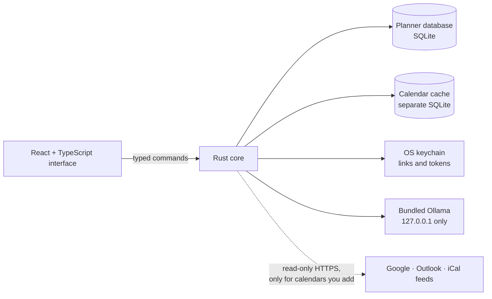

# DayPlan

**A local-first desktop planner that connects longer-range plans to what has to happen this week and today.**

DayPlan is for one person with several things going on — a launch, a move, a trip, a research project, a charity stream. Plans, milestones, and tasks sit beside a Today and Week agenda that also shows your Google, Outlook, and other calendars, read-only. An optional AI planner, running entirely on your machine, turns a messy request into changes you review before anything is saved.

> “Move gym to 6pm tomorrow, mark Book venue done, and add a Rent cameras task to Charity Week due October 9.”

DayPlan runs on macOS and Windows. There is no DayPlan account, no server, and no cloud AI.

[Releases](https://github.com/Von-Van/DayPlan/releases) · [Architecture](docs/architecture.md) · [Privacy](docs/privacy.md) · [AI planner](docs/ai.md) · [Roadmap](ROADMAP.md) · [Changelog](CHANGELOG.md)

## Why DayPlan?

A daily planner or notebook is quick, but it forgets the bigger thing today's task belongs to. A project-management suite remembers everything, but it's built for teams: custom statuses, sprints, dependencies, permissions. For one person juggling a few real projects, the first is too thin and the second is too heavy.

DayPlan explores the space in between:

- **One task, three horizons.** A task can wait in a plan's backlog, be chosen for this week, or be scheduled for a day. It is the same record moving Plan → Week → Today, never a copy.
- **Plans are optional.** Anything without a plan is still first-class, so DayPlan also works as a plain day planner.
- **Light by design.** A closed set of statuses; no custom fields, sprints, story points, Gantt editing, or automation. People are labels, not accounts.
- **Nothing moves on its own.** DayPlan shows planned work against available time and surfaces unfinished work, but you decide what moves.
- **AI assists; it never decides.** The planner proposes changes, and you accept or reject each one.

## Features

The lists below describe the current source (v0.3.5). The [changelog](CHANGELOG.md) says which version added what, and [Releases](https://github.com/Von-Van/DayPlan/releases) lists the published builds.

### Available

| Area               | What you get                                                                                                                                       |
| ------------------ | -------------------------------------------------------------------------------------------------------------------------------------------------- |
| Today and Week     | Events, tasks scheduled or due, milestones, time blocks, and other calendars' events side by side, with a plan filter                              |
| Plans              | Status, dates, and color; milestones and workstreams; an overview with attention signals, a timeline, a schedule, and a run of show for event days |
| Capture            | An Inbox and quick capture from anywhere (⌘I / Ctrl+I); items become tasks, plans, or events when you're ready                                     |
| Planning sessions  | Plan the Week and Plan Today, task estimates, and carry-forward of unfinished work — moved only when you say so                                    |
| Calendars          | Read-only Google Calendar and Outlook accounts, iCalendar links, and imported `.ics` files, refreshed every 30 minutes                             |
| Time and capacity  | Time blocks for tasks, working hours, days off, a daily limit, and "Planned 17 h, available 11 h" on Today, Week, and both planning sessions       |
| Reminders          | One reminder per event, delivered by the OS while DayPlan runs in the tray                                                                         |
| AI planner         | Natural-language requests become proposals for events, plans, milestones, and tasks, reviewed one suggestion at a time and applied atomically      |
| What DayPlan knows | A planning profile you set, and four observations computed from your own records, each showing its evidence and with an off switch                 |
| Data safety        | Transactional migrations with automatic backups, JSON export and import with a preview, restore from recent backups, private diagnostics           |

Everything except the AI planner works without a model installed.

### Experimental

- **Models other than `qwen3:8b`.** Any installed Ollama model can plan after passing a format check, but only `qwen3:8b` is evaluated.
- **Google and Outlook sign-in.** Connections work, but DayPlan's OAuth apps aren't verified yet: Google shows an "unverified app" warning, and work or school Microsoft accounts often need an administrator's approval. Subscribing by link works for any calendar.
- **Signed releases and in-app updates.** The signing, notarization, and update pipeline is built but inactive until signing credentials are configured. Published builds are unsigned pre-releases.

### Planned

From the [roadmap](ROADMAP.md):

- The AI planner converting inbox items, creating workstreams, and letting you edit a suggestion before applying it (v0.3.3).
- The AI planner using your planning profile and capacity. Preferred hours, focus and break lengths, and energy preference are recorded in the profile but not used yet.
- Templates, recurring tasks, checklists, plan duplication, lightweight task dependencies, and a system-wide capture shortcut (v0.4.0).

Not planned: team accounts, collaboration, cloud sync, two-way calendar sync, cloud AI, sprints, Gantt charts, and automation builders.

## How it works



DayPlan is a [Tauri 2](https://v2.tauri.app/) app. The React interface is deliberately the least-trusted layer: it calls a narrow set of typed commands and never touches SQL, secrets, files, or the network. Rust owns validation, revision-checked transactions, migrations, calendar sync, the local model's lifecycle, and native integrations such as notifications and the tray.

A few decisions shape everything else:

- **Every editable record carries a revision**, so a stale edit — manual or AI — fails with a conflict instead of overwriting newer data.
- **The AI model never gets a database handle.** It returns one schema-constrained proposal, Rust validates it, and only the suggestions you accept are applied, in one transaction.
- **Other apps' calendars live in their own cache**, apart from planner data, so exports, backups, and restores never touch them.
- **Times are stored in UTC with their IANA time zone**, and daylight saving gaps and overlaps are asked about, never guessed.

[Architecture](docs/architecture.md) covers the layers, data flows, and module map; [data model](docs/data-model.md) covers the schema and storage.

## Privacy

**Stays on your device:** plans, tasks, events, notes, people, the inbox, and your planning profile; AI requests, replies, and proposals (held in memory, never written to disk); calendar links and sign-in tokens (kept in the OS keychain and sent only to the service they belong to); logs, which hold event codes only; and diagnostics, which are written only when you ask.

**DayPlan goes online only when you:**

- add a calendar — DayPlan reads it from the provider or the link's host over HTTPS;
- approve the model download — the bundled Ollama fetches `qwen3:8b` from Ollama's registry;
- select **Check for updates** — DayPlan asks GitHub for the latest release; or
- open a link, such as the model's license page, in your browser.

DayPlan has no telemetry or analytics. The model runs locally and never sees notes, descriptions, locations, people, or other apps' calendars. [Privacy](docs/privacy.md) is the full, code-referenced inventory.

## Calendar integration

Calendars flow one way — into DayPlan — and stay read-only.

| Source            | How it connects                                                           |
| ----------------- | ------------------------------------------------------------------------- |
| Google Calendar   | OAuth in your browser with PKCE and the `calendar.readonly` scope         |
| Microsoft Outlook | OAuth in your browser with PKCE and `Calendars.Read`                      |
| iCalendar link    | Paste any `https://` or `webcal://` link, such as Google's secret address |
| `.ics` file       | Import a file; replace it with a newer one later                          |

Every request to a calendar API is a `GET`. Refresh tokens and private links go to the macOS Keychain or Windows Credential Manager; the interface never sees them. Events from other calendars count toward busy time but are never edited, exported, or sent to the AI planner. Disconnecting revokes access where the provider allows and deletes everything cached. [Calendar integration](docs/calendar-integration.md) covers sync, caching, recurrence, and failure handling, and [calendar accounts](docs/calendar-accounts.md) covers the OAuth clients.

## The AI planner

The planner runs a bundled, version-pinned Ollama server on a private loopback port and uses `qwen3:8b` (a 5.2 GB download you approve) or a model already installed on the machine. The runtime starts only when it's needed — a planner request, a model download, or a model check — and stops after five idle minutes; quitting DayPlan ends it.

Replies are constrained by a JSON Schema grammar to fifteen typed operations, validated again in Rust, and shown as a preview. Ambiguous requests get a question, not a guess. An evaluation harness scores the planner on 118 hand-labeled requests — including daylight saving edge cases and prompt injection — three runs at a time against the tested model. [The AI planner](docs/ai.md) explains the permission boundary, what the model sees, and what the latest recorded results cover.

## Running DayPlan

### Install

Download the latest build from [Releases](https://github.com/Von-Van/DayPlan/releases): a universal DMG for macOS 13 or later, or a setup `.exe` for Windows 10 22H2 or 11 (x64). Builds are unsigned pre-releases for now, so macOS asks you to approve the app in **System Settings → Privacy & Security** and Windows SmartScreen asks for confirmation on first launch. For the AI planner, 16 GB of RAM and about 10 GB of free disk space are recommended.

### Build from source

With [Node.js 24](.nvmrc), [Rust 1.97](rust-toolchain.toml), and the [Tauri prerequisites](https://v2.tauri.app/start/prerequisites/) for your platform:

```bash
git clone https://github.com/Von-Van/DayPlan.git
cd DayPlan
npm ci
npm run tauri dev
```

Development builds share their data folder with an installed DayPlan. To use the AI planner in development, fetch the pinned runtime first with `bash scripts/fetch-ollama-runtime.sh` (macOS). [Development](docs/development.md) covers the runtime, every command, the evaluation harness, and releasing.

### Test

```bash
npm test
cargo test --manifest-path src-tauri/Cargo.toml
```

CI also runs formatting, type-checking, clippy, dependency audits, license checks, and unsigned macOS and Windows builds on every pull request.

## Technology

| Layer     | Built with                                                                                                       |
| --------- | ---------------------------------------------------------------------------------------------------------------- |
| App shell | Tauri 2 and the system WebView                                                                                   |
| Interface | React 18, TypeScript, Vite, Zod, date-fns; bundled Fontsource typefaces; CSS geometry instead of an icon library |
| Core      | Rust: rusqlite (bundled SQLite), tokio, reqwest with rustls, chrono-tz, calcard for iCalendar, keyring stores    |
| Local AI  | Ollama 0.32.0, bundled and checksum-verified; `qwen3:8b`; structured outputs                                     |
| Quality   | Vitest, cargo test, clippy, Prettier, npm audit, cargo-audit, cargo-deny, and an AI evaluation harness           |
| Delivery  | GitHub Actions: universal DMG, NSIS installer, and a signing, notarization, updater, and SBOM pipeline           |

## Repository layout

```text
src/                  React interface; src/api.ts is the only bridge to Rust
src-tauri/src/        Rust core: db/ (planner storage), calendar/, agent/ (AI planner),
                      runtime.rs (Ollama), capacity.rs, lib.rs (commands and app setup)
src-tauri/examples/   The AI evaluation harness
eval/                 Hand-labeled planner cases and the latest results
docs/                 Architecture, data model, privacy, AI, calendars, development, releases
scripts/              Version checks, Ollama runtime fetch and verify, release packaging
.github/workflows/    CI, and the signed and unsigned release pipelines
```

## Documentation

- [Architecture](docs/architecture.md) — layers, entry points, state, data flows, and why the boundaries are where they are
- [Data model](docs/data-model.md) — the schema, storage locations, migrations, export, and backups
- [Privacy](docs/privacy.md) — what is stored, what leaves the device, and what the AI model sees
- [The AI planner](docs/ai.md) — runtime, permission boundary, model context, and evaluation
- [Calendar integration](docs/calendar-integration.md) and [calendar accounts](docs/calendar-accounts.md) — sync design and OAuth setup
- [Development](docs/development.md) — setup, commands, tests, adding a feature, and releasing
- [Release checklist](docs/release-checklist.md) — the manual gate before publishing a beta
- [Roadmap](ROADMAP.md) and [changelog](CHANGELOG.md)

## How DayPlan is built

DayPlan is developed with AI coding assistants, including Anthropic's Claude through Claude Code, which is credited as a co-author on the release commits it helped write. The project owner sets the product direction, requirements, architecture, privacy and integration decisions, and reviews and accepts every change; the roadmap's recorded decisions, the tests, the evaluation gates, and the release checklist are where that judgment is written down. [Contributing](CONTRIBUTING.md#ai-assisted-development) describes the workflow.

DayPlan started in February 2026 as a Flask web app, became a SwiftUI iOS app with widgets in June — preserved on the [`ios-swiftui`](https://github.com/Von-Van/DayPlan/tree/ios-swiftui) branch, with its own separate data — and was rebuilt as this desktop app in August.

## Contributing

Bug reports and focused fixes are welcome. [CONTRIBUTING.md](CONTRIBUTING.md) explains the project's direction, ground rules, and pull request checklist.

## License

DayPlan is released under the [MIT License](LICENSE). The bundled Ollama runtime is MIT-licensed (its license ships with the app), the bundled typefaces — Archivo, Cormorant Garamond, and IBM Plex Mono — use the SIL Open Font License 1.1, and the `qwen3:8b` model is downloaded separately under [its own license](https://ollama.com/library/qwen3%3A8b).
