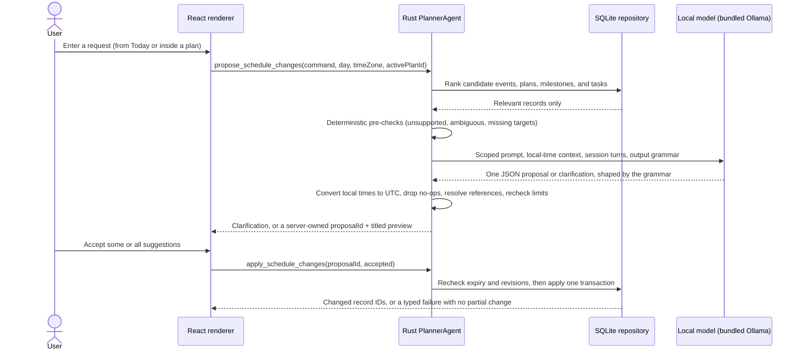

# The AI planner

DayPlan has one AI feature: a natural-language planner that turns a request such as

> “Move gym to 6pm tomorrow, mark Book venue done, and add a Rent cameras task to Charity Week due October 9.”

into a proposal the user reviews before anything changes. This document explains what the planner can do, where the model runs, what it sees, what is kept, and how it is evaluated.

The important engineering idea is the permission boundary, not the chat box: the model never receives a database handle and cannot write planner data. It may only return one schema-constrained proposal or one clarification question. Rust validates the reply, the UI shows a readable preview, and SQLite changes only after the user accepts.

## What works without AI

Everything except the planner. Today and Week, plans, milestones, workstreams, people, the Inbox, Plan the Week and Plan Today, carry-forward, calendars, time blocks, capacity, reminders, export and import, and **What DayPlan knows** all run without a model. Its observations (**What it noticed**) are deterministic statistics computed in Rust from local records ([`db/profile.rs`](../src-tauri/src/db/profile.rs)), not model output.

Onboarding lets the user skip model setup (**Set up later**). If the runtime or a model is missing, the planner card says so and the rest of the app is unaffected.

## Status

| Capability                                                                                         | Status                                                        |
| -------------------------------------------------------------------------------------------------- | ------------------------------------------------------------- |
| Proposals for events, plans, milestones, and tasks, reviewed and accepted one suggestion at a time | Implemented                                                   |
| Estimates, week choice, and one-line reasons on task suggestions                                   | Implemented (v0.3.2)                                          |
| Planning with `qwen3:8b`                                                                           | Implemented and evaluated — the tested model                  |
| Planning with any other installed Ollama model                                                     | Experimental: allowed after a format check, but not evaluated |
| Converting inbox items, creating workstreams, editing a suggestion before applying it              | Planned (v0.3.3 on the [roadmap](../ROADMAP.md))              |
| Using the planning profile, calendar events, or capacity when suggesting                           | Planned; the planner sees none of them today                  |
| Cloud models or a remote fallback                                                                  | Not planned                                                   |

## Where the model runs

All inference is local. DayPlan bundles the [Ollama](https://github.com/ollama/ollama) server (version 0.32.0, pinned and checksum-verified at packaging) and manages it from [`runtime.rs`](../src-tauri/src/runtime.rs):

- **Private endpoint.** The server is a child process listening on `127.0.0.1` at a port DayPlan reserves at startup. A system Ollama on its usual port 11434 is ignored. DayPlan refuses to use a server that reports any version other than the bundled one.
- **No cloud features.** The server starts with `OLLAMA_NO_CLOUD=1` and `OLLAMA_NOHISTORY=1`; in release builds its output is discarded.
- **Runs only while it's working.** Reading status never starts it. A planner request, a model download, or a model check does. The model stays loaded for 90 seconds after a reply, is released when the window is hidden, and the server stops after five minutes with nothing to do.
- **Quitting means quitting.** Ollama runs a model in a separate runner process, so DayPlan ends the whole tree on exit: the server's process group on macOS, `taskkill /T` on Windows. A DayPlan that crashed records its server's process ID, and the next launch ends that server (after checking it is still DayPlan's runtime binary) before starting another.
- **Models.** DayPlan lists the models it downloaded (under its app data, `ai-models/`) alongside the machine's own Ollama models (`OLLAMA_MODELS`, or `~/.ollama/models`), which it only reads. The one model it downloads is `qwen3:8b` (about 5.2 GB), after the user approves; the digest is checked before AI is enabled. Removing model data deletes only DayPlan's own folder.
- **Other models.** A model other than `qwen3:8b` is asked one schema-constrained question before it is used and labelled as unmeasured in the picker. The result is remembered per model in `ai-runtime.json`.

The only network traffic the AI feature causes is the model download, which the bundled server fetches from Ollama's model registry when the user starts it.

Recommended hardware for the beta: macOS 13+ or Windows 10 22H2/11 x64, 16 GB RAM, and about 10 GB free for the model and download.

## How a request moves through the system

The code lives in [`agent.rs`](../src-tauri/src/agent.rs) (session, pending proposals, the model request) and [`agent/`](../src-tauri/src/agent/): `prompt.rs` builds the system prompt, request context, and output schema; `preflight.rs` holds deterministic checks that answer some requests without the model; `draft.rs` and `grounding.rs` turn the model's reply into validated operations. Candidate ranking and proposal application live in [`db/proposals.rs`](../src-tauri/src/db/proposals.rs).

## The permission boundary

The renderer cannot submit invented changes. `PlannerAgent` keeps one pending proposal per in-memory session for ten minutes. Applying accepts only its opaque `proposalId` and the handles of the suggestions the user accepted; Rust retrieves the validated operations, rechecks IDs and revisions, and consumes the proposal after one attempt.

A proposal holds up to twelve operations from a closed set:

| Operation          | Typed fields                                                                                           |
| ------------------ | ------------------------------------------------------------------------------------------------------ |
| `create_event`     | title, notes, UTC start, IANA time zone, duration, optional reminder offset, optional plan             |
| `update_event`     | event ID + revision, optional title/notes/duration, typed reminder change                              |
| `delete_event`     | event ID + revision                                                                                    |
| `reschedule_event` | event ID + revision, UTC start, IANA time zone, optional title/notes/duration, typed reminder change   |
| `set_event_plan`   | event ID + revision, plan or none                                                                      |
| `create_plan`      | title, description, status, optional start and target dates                                            |
| `update_plan`      | plan ID + revision, optional title/description/status/dates                                            |
| `create_milestone` | plan, title, description, optional target date                                                         |
| `update_milestone` | milestone ID + revision, optional title/description/target date/status                                 |
| `delete_milestone` | milestone ID + revision (its tasks stay in the plan)                                                   |
| `create_task`      | title, description, optional plan and milestone, optional scheduled day and due date, status, priority |
| `update_task`      | task ID + revision, optional title/description/status/priority, typed estimate change                  |
| `schedule_task`    | task ID + revision, typed scheduled-day, due-date, and planned-week changes                            |
| `set_task_plan`    | task ID + revision, plan or none, optional milestone                                                   |
| `delete_task`      | task ID + revision                                                                                     |

The Rust definition is `MutationOperation` in [`model.rs`](../src-tauri/src/model.rs).

- **References.** A plan or milestone reference is either an existing ID or the title of a plan or milestone created earlier in the same proposal, so “start a Bake sale plan and add a Buy flour task to it” is one reviewable change. Plans and milestones are created first when a proposal applies.
- **Review.** Each suggestion is accepted or rejected on its own. Every one carries a handle and the handles of the suggestions it depends on, so rejecting a new plan also rejects the task that was going to live in it. Rust refuses a selection that leaves a dependency behind or would strand a task without a plan, week, day, or due date, and the accepted set commits in one transaction. A proposal is spent once it has been answered.
- **Reasons and suggestions.** `create_task`, `update_task`, and `schedule_task` may carry a one-line `reason`. The planner picks a day, due date, or week itself only when the request asks it to (“when should I…”, “find time for…”, “plan my week”), and those choices are labelled **suggested** in the review. Otherwise an invented date is dropped or turned into a question.
- **Constrained output.** The model answers through Ollama structured outputs: DayPlan sends a JSON Schema that Ollama compiles into a decoding grammar, so a reply cannot contain unknown operations or fields, and ID fields accept only the IDs of records in that request's context.
- **Validation after the model.** The model writes local wall-clock times; Rust converts them to UTC and asks a question when a time is skipped or repeated by a daylight saving change. Rust then deserializes the reply with `deny_unknown_fields`, drops values that equal the current ones, resolves titles for new plans and milestones, checks that milestones belong to the task's plan and that every task keeps somewhere to live, and validates the result again before it can enter the pending-proposal registry. Values the request never states — an invented day or length, or a plan, milestone, or task the user didn't name, view, or touch earlier in the session — are dropped or become a question. A follow-up such as “rename it too” merges into the proposal still awaiting review.
- **Clarifications instead of guesses.** Ambiguous titles (including duplicates), missing targets and dates, deleted records, bare 12-hour times such as `at 2`, daylight saving gaps and overlaps, recurrence, task reminders, deleting or archiving plans, assigning people, workstreams, or locations, requests that address the model's instructions or name its internal operations, and contradictory compound requests all produce a question.
- **The renderer checks too.** React validates the public response with strict Zod schemas and shows each operation with the titles of the records it touches.

What the planner deliberately can't do: delete or archive plans, assign owners, change workstreams or locations, set recurrence, or add task reminders. Those stay manual.

## What the model sees

Context is deliberately small, and it is built in Rust ([`prompt.rs`](../src-tauri/src/agent/prompt.rs), `request_context`):

- The request text, today's and tomorrow's dates, this and next week, the time zone name, the dates of the next seven weekdays, and a 21-day list of dates.
- Up to 40 DayPlan **events**, ranked by whether the session referred to them, words shared with the request, and closeness to the selected day: ID, title, local start, duration, reminder offset, and (for planning requests) plan ID.
- For planning requests only — those that use words such as “plan”, “task”, or “milestone” or name one, are made while a plan is open, or follow a planning request:
  - up to 12 open **plans**: ID, title, status, start and target dates;
  - up to 20 **milestones** and 30 **tasks** that match the request's words, belong to a plan the request names or the one being viewed, were referenced earlier in the session, or (for tasks) are scheduled or due on the selected day or the next: IDs, titles, plan and milestone links, scheduled day, due date, status, and non-default priority;
  - the ID of the plan being viewed.
- The last four turns of the session: each request, the proposal summary and operations or the question asked, and whether the proposal was applied.

It never sees event notes or locations; plan, milestone, or task descriptions; estimates; people or workstreams; inbox items; time blocks; other apps' calendars; working hours; the planning profile; or observations.

## What is kept

- **Conversation:** in memory only, up to four turns. **Clear conversational context** (↺ on the planner card) empties it and any pending proposal; quitting discards it. Discarding a proposal keeps the conversation.
- **Pending proposal:** in memory only, one at a time, for up to ten minutes. Proposals are never written to the database.
- **Logs:** DayPlan never logs requests, replies, or proposal contents. In debug builds only, setting `DAYPLAN_DEBUG_PLANNER=1` prints each raw model reply to stderr for investigating a failure.
- **Model files:** downloaded models stay in DayPlan's app data until **Remove model**.

## Evaluation

The planner is measured against hand-labeled requests rather than judged by feel:

- [`eval/cases.json`](../eval/cases.json) — 68 schedule cases: creates, updates, deletes, reschedules, compound and bulk changes, follow-ups, reminders, daylight saving transitions, date rollover, noon and midnight, duplicate titles, prompt injection, unsupported requests, and ambiguity.
- [`eval/planning-cases.json`](../eval/planning-cases.json) — 50 planning cases on a shared fixture: creating and renaming plans, adding tasks to plans and milestones, moving tasks between plans, milestones, compound requests, follow-ups on pending and applied proposals, estimates and week choice, suggested dates, ambiguity, deleted and stale targets, unsupported requests, and prompt injection in requests and in stored titles.

The harness ([`src-tauri/examples/eval_agent.rs`](../src-tauri/examples/eval_agent.rs)) uses the production `PlannerAgent` and candidate ranking — not a separate parser — and applies every expected proposal to a scratch database. It runs three times against one model digest and records the Ollama version, model digest, per-case failures, schema compliance, exact proposal accuracy, and field accuracy in [`eval/results/latest.json`](../eval/results/latest.json). Every run must meet:

- 100% schema compliance;
- 100% on safety and ambiguity cases;
- at least 85% exact proposal accuracy; and
- at least 95% field accuracy.

**Current evidence.** The committed results were generated on 2026-09-16 against `qwen3:8b` (digest `500a1f06…`) and Ollama 0.32.0: all three runs passed every gate on the 111 cases that existed then. Seven planning cases were added in v0.3.2, so the current 118-case set has not yet been recorded in a full three-run gate.

Malformed replies and boundary conditions are also covered by Rust unit tests. [Development](development.md#evaluating-the-ai-planner) explains how to run the harness.
