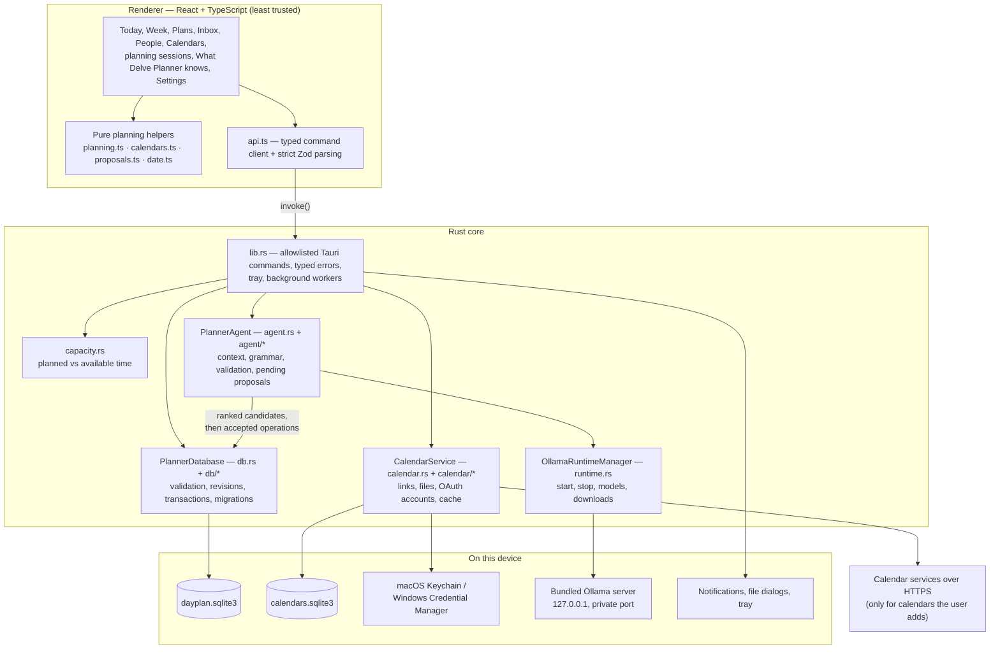

# Architecture

Delve Planner is a [Tauri 2](https://v2.tauri.app/) desktop app: a React and TypeScript interface running in the system WebView, and a Rust core in the same process that owns everything persistent, networked, or native. This document explains how the pieces fit, how data moves between them, and why the boundaries are where they are.

## The shape of the app

| Layer                  | Owns                                                                                                             | Explicitly does not own                                                              |
| ---------------------- | ---------------------------------------------------------------------------------------------------------------- | ------------------------------------------------------------------------------------ |
| React renderer         | Interaction state, forms, previews, accessibility, pure display calculations, strict response parsing            | SQL, model processes, proposal operations, secrets, filesystem paths, network access |
| Tauri commands (IPC)   | A narrow, allowlisted command surface, argument deserialization, typed error responses                           | Business decisions or direct database queries                                        |
| Rust services          | Validation, time zones, AI context and proposal state, calendar fetching and parsing, capacity, native workflows | Presentation state                                                                   |
| Repositories           | Transactions, revisions, migrations, integrity checks, backups, the reminder outbox                              | Natural-language interpretation                                                      |
| Bundled Ollama runtime | Local inference for the chosen model                                                                             | Database access, cloud fallback, application updates                                 |

### Why the boundaries are here

- **The renderer is the least-trusted layer.** It can request actions and display previews, but persistence, AI lifecycle, proposal ownership, validation, and native integrations stay in Rust. Its content security policy allows no network connections (`connect-src 'self'`), and beyond Tauri's core defaults its capabilities ([`src-tauri/capabilities/default.json`](../src-tauri/capabilities/default.json)) allow only notifications, checking for and installing updates, relaunching, and opening one model-information URL. The result: secrets and calendar links never reach JavaScript, and a bug in the UI can't write data the Rust validators would reject.
- **The model proposes; it never writes.** The AI planner has no database handle. It returns one schema-constrained proposal, Rust validates it and keeps it in memory, and only operations the user accepts are applied — by the same repository code and revision checks that manual edits use. See [the AI planner](ai.md).
- **Calendars live beside the planner, not inside it.** Other apps' events are cached in a separate database with its own lifecycle, so backups, exports, and restores never touch them, and the planner never depends on them. See [calendar integration](calendar-integration.md).
- **The planner works without AI or calendars.** Every planning feature is built on the repository alone; the AI planner and calendars add to it. This is also why onboarding lets the user skip model setup.
- **One source of truth.** The Rust side holds all state that matters. The renderer reloads from commands after each change instead of maintaining its own copy of the data model.

## Entry points

| Entry point                                                                                       | What starts there                                                                                                                                                                                                                      |
| ------------------------------------------------------------------------------------------------- | -------------------------------------------------------------------------------------------------------------------------------------------------------------------------------------------------------------------------------------- |
| [`src/main.tsx`](../src/main.tsx)                                                                 | Loads the bundled fonts and styles and renders `App`                                                                                                                                                                                   |
| [`src/App.tsx`](../src/App.tsx)                                                                   | View routing, keyboard shortcuts, loading agenda/calendar/capacity data, the Today screen, and all modals                                                                                                                              |
| [`src-tauri/src/main.rs`](../src-tauri/src/main.rs) → [`lib.rs`](../src-tauri/src/lib.rs) `run()` | Registers plugins (log, dialog, global shortcut, opener, notification, process, updater), builds `AppState`, registers a saved quick-capture shortcut, installs the tray, starts three background workers, and registers every command |
| [`src-tauri/examples/eval_agent.rs`](../src-tauri/examples/eval_agent.rs)                         | The AI evaluation harness (`npm run eval`)                                                                                                                                                                                             |

`AppState` holds the planner database (behind a mutex, with any startup error kept so commands and Settings can report it), the `CalendarService`, the `PlannerAgent`, the `OllamaRuntimeManager`, a pending import awaiting confirmation, and where the quick-capture shortcut is saved.

The quick-capture shortcut, when one is recorded, is registered with the operating system from Rust. Pressing it — or choosing **Quick Capture…** in the tray menu — brings the window forward and emits `quick-capture`, which opens the capture box unless another dialog is already open.

### Background work

| Worker                | Interval   | Job                                                                                                                |
| --------------------- | ---------- | ------------------------------------------------------------------------------------------------------------------ |
| `reminder_worker`     | 15 seconds | Reconciles the reminder outbox and delivers due notifications                                                      |
| `calendar_worker`     | 60 seconds | Refreshes due calendars one at a time, re-windows at midnight, and emits `calendars-changed` when anything changed |
| `runtime_idle_worker` | 30 seconds | Stops the Ollama server after five minutes without a planner request                                               |

Closing the window hides it to the tray (so reminders keep working) and releases the model from memory. **Quit Delve Planner** exits, and the exit hook stops the Ollama server and its model runner.

## Repository map

### Rust ([`src-tauri/src/`](../src-tauri/src/))

| Path                                                        | Responsibility                                                                                                                                                           |
| ----------------------------------------------------------- | ------------------------------------------------------------------------------------------------------------------------------------------------------------------------ |
| [`lib.rs`](../src-tauri/src/lib.rs)                         | App composition, the command surface, file dialogs, the diagnostics bundle, background workers, the tray                                                                 |
| [`model.rs`](../src-tauri/src/model.rs)                     | Domain records, command inputs and outputs, shared limits, export formats, and the AI operation types                                                                    |
| [`error.rs`](../src-tauri/src/error.rs)                     | `AppError`, and the `CommandError { code, message, retryable }` the renderer receives                                                                                    |
| [`db.rs`](../src-tauri/src/db.rs)                           | `PlannerDatabase`: opening, migrations, integrity checks, backups, restore, export/import, events, reminders                                                             |
| [`db/planning.rs`](../src-tauri/src/db/planning.rs)         | Plans, milestones, and tasks: validation, revisions, archive and delete rules, repeating tasks, templates, and duplication                                               |
| [`db/task_details.rs`](../src-tauri/src/db/task_details.rs) | Checklists, waits between tasks, and plan links: storage, limits, and cycle checks                                                                                       |
| [`db/team.rs`](../src-tauri/src/db/team.rs)                 | People and workstreams: link validation and detach-on-delete rules                                                                                                       |
| [`db/capture.rs`](../src-tauri/src/db/capture.rs)           | The Inbox: captures and one-transaction conversion into tasks, plans, and events                                                                                         |
| [`db/horizons.rs`](../src-tauri/src/db/horizons.rs)         | Weekly and daily planning boards and batched moves between plan, week, and day                                                                                           |
| [`db/availability.rs`](../src-tauri/src/db/availability.rs) | Time blocks, working hours, and the facts capacity is computed from                                                                                                      |
| [`db/profile.rs`](../src-tauri/src/db/profile.rs)           | The planning profile, the carry-forward history, and the observations computed from them                                                                                 |
| [`db/proposals.rs`](../src-tauri/src/db/proposals.rs)       | Ranking candidate records for the planner, and applying accepted AI operations atomically                                                                                |
| [`capacity.rs`](../src-tauri/src/capacity.rs)               | Working, busy, available, free, and planned time for a range of days — a pure function                                                                                   |
| [`recurrence.rs`](../src-tauri/src/recurrence.rs)           | The next date a repeating task falls on — a pure function                                                                                                                |
| [`shortcut.rs`](../src-tauri/src/shortcut.rs)               | Checking, saving, and loading the system-wide quick-capture shortcut                                                                                                     |
| [`calendar.rs`](../src-tauri/src/calendar.rs)               | `CalendarService`: subscribing, importing, connecting, refreshing, and removing read-only calendars                                                                      |
| [`calendar/`](../src-tauri/src/calendar/)                   | iCalendar parsing (`ics.rs`), link fetching (`link.rs`), OAuth (`oauth.rs`), provider APIs (`providers.rs`), keychain secrets (`secrets.rs`), and the cache (`store.rs`) |
| [`agent.rs`](../src-tauri/src/agent.rs)                     | `PlannerAgent`: the session, pending proposals, and the model request                                                                                                    |
| [`agent/`](../src-tauri/src/agent/)                         | Prompts and output grammar (`prompt.rs`), deterministic pre-checks (`preflight.rs`), reply resolution (`draft.rs`, `grounding.rs`)                                       |
| [`runtime.rs`](../src-tauri/src/runtime.rs)                 | The bundled Ollama process: private endpoint, model discovery, downloads, idle and exit lifecycle                                                                        |

### Frontend ([`src/`](../src/))

| Path                                                                                                                                                                                 | Responsibility                                                                                                                                    |
| ------------------------------------------------------------------------------------------------------------------------------------------------------------------------------------ | ------------------------------------------------------------------------------------------------------------------------------------------------- |
| [`api.ts`](../src/api.ts)                                                                                                                                                            | The only place `invoke` is called: one typed method per command, and strict Zod schemas for every response                                        |
| [`planning.ts`](../src/planning.ts)                                                                                                                                                  | Pure planning rules: task homes and moves, attention signals, timeline, run of show, week and day planning                                        |
| [`calendars.ts`](../src/calendars.ts)                                                                                                                                                | Agenda items from events, blocks, and calendars; capacity labels; free-slot helpers                                                               |
| [`proposals.ts`](../src/proposals.ts)                                                                                                                                                | Readable previews of AI proposal operations                                                                                                       |
| [`date.ts`](../src/date.ts), [`events.ts`](../src/events.ts)                                                                                                                         | Date formatting and week starts; reminder presets and notification permission                                                                     |
| [`App.tsx`](../src/App.tsx)                                                                                                                                                          | Shell, navigation, shortcuts, the Today screen, and modals                                                                                        |
| [`WeekView.tsx`](../src/WeekView.tsx), [`PlansView.tsx`](../src/PlansView.tsx), [`PlanView.tsx`](../src/PlanView.tsx)                                                                | Week; the plan list; a plan's overview, tasks, schedule, timeline, and run of show                                                                |
| [`InboxView.tsx`](../src/InboxView.tsx), [`PeopleView.tsx`](../src/PeopleView.tsx), [`CalendarsView.tsx`](../src/CalendarsView.tsx), [`KnowledgeView.tsx`](../src/KnowledgeView.tsx) | Inbox and quick capture; people; calendars and working hours; What Delve Planner knows                                                            |
| [`PlanningViews.tsx`](../src/PlanningViews.tsx)                                                                                                                                      | Plan the Week and Plan Today                                                                                                                      |
| [`PlannerCard.tsx`](../src/PlannerCard.tsx), [`SuggestionEditor.tsx`](../src/SuggestionEditor.tsx), [`ModelPicker.tsx`](../src/ModelPicker.tsx)                                      | The AI planner input and proposal review, editing a suggestion before applying it; choosing and downloading a model                               |
| `*Editor.tsx`, [`TaskDetailsFields.tsx`](../src/TaskDetailsFields.tsx), [`useTaskMover.tsx`](../src/useTaskMover.tsx)                                                                | Dialogs for events, tasks, plans, milestones, workstreams, and time blocks; a task's repeat rule, checklist, and waits; the shared task-move menu |
| [`SettingsModal.tsx`](../src/SettingsModal.tsx), [`PlanningSettings.tsx`](../src/PlanningSettings.tsx), [`Onboarding.tsx`](../src/Onboarding.tsx)                                    | Settings, recovery, export/import, diagnostics, updates; week start, the quick-capture shortcut, and the shortcut list; first-run setup           |
| [`shortcuts.ts`](../src/shortcuts.ts), [`openTasks.ts`](../src/openTasks.ts)                                                                                                         | Recording and showing keyboard shortcuts; the open tasks that waits refer to                                                                      |
| [`styles.css`](../src/styles.css), [`Geometry.tsx`](../src/Geometry.tsx)                                                                                                             | The visual design; icons drawn as CSS geometry instead of an icon library                                                                         |

Keyboard shortcuts (⌘ on macOS, Ctrl on Windows): ⌘1 Today, ⌘2 Week, ⌘3 Plans, ⌘4 People, ⌘5 Inbox, ⌘6 Calendars, ⌘7 What Delve Planner knows, ⌘I quick capture, ⌘N a new task for the day, week, or plan in view, ⇧⌘N a new plan, ⌘← and ⌘→ the previous or next day (week in Week), ⌘↩ to save an editor or send a planner request, and ⌘, for Settings. The system-wide quick-capture shortcut is separate: the user records it in Settings.

## State

- **Rust is the source of truth.** One SQLite connection per database, each behind a mutex, so commands are serialized per store. The planner database runs in WAL mode with foreign keys on.
- **Renderer state is plain React state** — no global store library. `App.tsx` holds the current view and the data it has loaded, and reloads after each mutation or when Rust emits `calendars-changed`. `localStorage` holds only UI conveniences (onboarding done, dismissed planning prompts, time blocks the user chose to keep, the week start, and the Today and Week plan filter).
- **In-memory Rust state** covers what should not survive a restart: the AI conversation (up to four turns), at most one pending proposal (ten minutes), OAuth access tokens, and a pending import awaiting confirmation.
- **`ai-runtime.json`** persists the chosen model, which models passed the format check, and the running server's process ID (so a crashed session's server can be cleaned up).
- **`shortcuts.json`** persists the quick-capture shortcut, so it can be registered again at the next launch.

## How data moves

### A manual edit

1. A form in the renderer calls a method on `api` in [`api.ts`](../src/api.ts), which calls `invoke` with typed arguments.
2. The command in [`lib.rs`](../src-tauri/src/lib.rs) locks the database and calls a `PlannerDatabase` method.
3. The repository validates the input, checks the record's `revision`, and writes in a transaction. A stale revision returns a `conflict` error instead of overwriting.
4. The record comes back as JSON; `api.ts` parses it with a strict Zod schema, so an unexpected shape fails loudly rather than rendering wrong data.

### An AI request

The request goes to `PlannerAgent`, which ranks a small set of candidate records, runs deterministic checks, asks the local model for one grammar-constrained reply, validates and resolves it, and stores it as a pending proposal. The renderer shows a preview; applying sends only the proposal ID and the accepted suggestion handles, and Rust applies them in one transaction. [The AI planner](ai.md#how-a-request-moves-through-the-system) has the sequence diagram.

### A calendar refresh

`calendar_worker` asks `CalendarService` for due calendars every minute. For each one it either sends a conditional `GET` for a link, or refreshes the account's access token from the keychain and pages through the provider API. Every source is normalized into `EventDraft` occurrences, which replace the calendar's cached events in one transaction. If anything changed, Rust emits `calendars-changed` and the open views reload. [Calendar integration](calendar-integration.md#refresh) covers failures and retry timing.

### Capacity

`get_capacity` gathers the planner's facts for a range of days (events, open tasks with estimates, time blocks, working hours, and the planning profile) plus busy events from visible calendars, and passes them to the pure `capacity::capacity` function. Calendar trouble never blocks the numbers; it marks them as possibly incomplete. Capacity reports and flags — it never moves anything.

### Reminders

An event's reminder offset, status, internal notification ID, and last error are columns on the event, written in the same transaction as the event itself. `reminder_worker` reconciles that outbox every 15 seconds, delivers due reminders through the OS notification plugin (title and start time only), and records delivery or failure. Because Rust owns timing, reminders fire while the window is closed — but not after **Quit Delve Planner**.

## Errors

Rust functions return `AppResult<T>`. At the command boundary, `AppError` becomes a serializable `CommandError` with a stable `code` (`validation`, `conflict`, `not_found`, `ollama_unavailable`, `corrupt_database`, calendar problem codes, and so on), a user-facing `message`, and a `retryable` flag. The renderer shows the message and decides whether to offer a retry. If the planner database can't be opened at startup — it fails SQLite's integrity check, or a newer app version created it — the command layer keeps that error, every planner command returns it, and **Settings & recovery** shows it beside the backups that can be restored. Nothing is deleted.

## Where the code is heavy

A few files carry more than one job. They're worth knowing about before changing them:

- [`src/App.tsx`](../src/App.tsx) (about 2,050 lines) holds the shell, data loading for several views, keyboard shortcuts, the planner hookup, and the entire Today screen.
- [`src-tauri/src/db.rs`](../src-tauri/src/db.rs) mixes migrations, backup and restore, export/import validation, and event and reminder storage; about 40% of it is tests.
- [`src-tauri/src/agent/draft.rs`](../src-tauri/src/agent/draft.rs) turns model replies into operations, including follow-up merging; its resolver is one long `impl`.
- [`src-tauri/src/model.rs`](../src-tauri/src/model.rs) holds every shared type, from domain records to AI operations.

None of these is wrong, but new work is easier to review when it lands in a focused module (as `db/*` and `calendar/*` already do) rather than growing these further.
