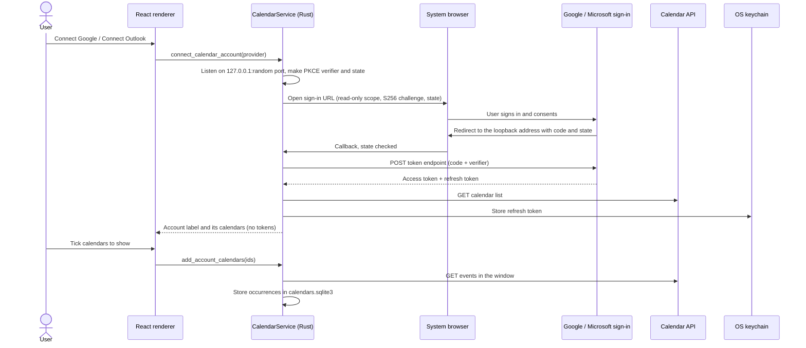

# Calendar integration

Delve Planner shows events from other calendars beside its own plans so it can tell when you're actually busy. Access is one-way — **external calendar → Delve Planner** — and read-only. This is the design the calendar code in [`src-tauri/src/calendar.rs`](../src-tauri/src/calendar.rs) and [`src-tauri/src/calendar/`](../src-tauri/src/calendar/) follows: who owns which data, how calendars are cached and refreshed, how recurring events and time zones are read, and what happens when access ends.

**Status:** iCalendar links and files, time blocks, working hours, and capacity shipped in v0.2.9. Google and Microsoft accounts followed in v0.3.0, reusing all of it. [Calendar accounts](calendar-accounts.md) covers the OAuth clients behind them.

## Principles

- **Read-only.** Delve Planner never writes to another calendar. Events from other calendars can't be edited, linked to plans, reminded about, or turned into Delve Planner events.
- **Separate.** External events never get Delve Planner event IDs, never mix with `schedule_events`, and aren't exported, backed up, restored, or sent to the local planner.
- **Local.** There is no Delve Planner server. Delve Planner contacts a calendar service only for calendars the user adds, and only from Rust. The renderer's content security policy (`connect-src 'self'`) keeps it from making network requests of its own.
- **Secrets stay in the keychain.** A private calendar link grants read access to that calendar, so it's treated like an OAuth token.
- **Nothing moves on its own.** Capacity reports planned work against available time and never reschedules anything.

## Supported sources

| Source            | How it's added                               | Read with                                                                                                    | Refresh                            |
| ----------------- | -------------------------------------------- | ------------------------------------------------------------------------------------------------------------ | ---------------------------------- |
| iCalendar link    | Paste an `https://` or `webcal://` link      | One conditional `GET` of the feed, parsed and expanded locally                                               | Every 30 minutes                   |
| iCalendar file    | **Import .ics file**                         | The chosen file, parsed and expanded locally                                                                 | Only when a newer file replaces it |
| Google Calendar   | **Connect Google** (OAuth, read-only scope)  | `calendarList.list`, then `events.list` with `singleEvents=true` inside the window; `transparency` sets busy | Every 30 minutes                   |
| Microsoft Outlook | **Connect Outlook** (OAuth, read-only scope) | `/me/calendars`, then `calendarView` inside the window; `showAs` sets busy and tentative                     | Every 30 minutes                   |

Both account providers expand recurrence themselves, so account calendars skip the iCalendar parser entirely and arrive as occurrences already. Plain `http://` links are refused, and redirects that leave `https` are not followed.

## One event shape for every provider

Provider-specific code is confined to two files:

- [`calendar/oauth.rs`](../src-tauri/src/calendar/oauth.rs) — each provider's sign-in and token endpoints, client ID, and scopes.
- [`calendar/providers.rs`](../src-tauri/src/calendar/providers.rs) — each provider's API calls and the mapping from its JSON into Delve Planner's event shape.

iCalendar links and files go through [`calendar/link.rs`](../src-tauri/src/calendar/link.rs) (fetching) and [`calendar/ics.rs`](../src-tauri/src/calendar/ics.rs) (parsing and recurrence). Every source produces the same `EventDraft` occurrences for a window of local days. From there on, storage ([`calendar/store.rs`](../src-tauri/src/calendar/store.rs)), display, and capacity ([`capacity.rs`](../src-tauri/src/capacity.rs)) work with one `ExternalEvent` type and don't know where an event came from:

| Field                            | Meaning                                                           |
| -------------------------------- | ----------------------------------------------------------------- |
| `calendarId`, `key`              | The calendar, and a stable hash of the event's UID and start      |
| `title`, `location`              | Trimmed to 200 characters; descriptions and attendees aren't kept |
| `startAtUtc`, `endAtUtc`         | Timed occurrences                                                 |
| `startDate`, `endDate`           | All-day occurrences in local dates, end exclusive                 |
| `busy`, `tentative`, `recurring` | Availability and display hints                                    |

The providers are an enum (`CalendarProvider::Google | Microsoft`) matched in those two files rather than a trait. Adding an OAuth provider means a new variant, its sign-in configuration, and an API mapping that returns `EventDraft`s; nothing downstream changes. A source that serves iCalendar needs no provider code at all.

## What Delve Planner retrieves

| Source         | Requested from the service                                                                                                                     | Kept                                                                                                                                                                                                  |
| -------------- | ---------------------------------------------------------------------------------------------------------------------------------------------- | ----------------------------------------------------------------------------------------------------------------------------------------------------------------------------------------------------- |
| Google         | The calendar list and the events in the window. Delve Planner doesn't narrow the response, so Google returns whole resources.                  | From the list, each calendar's ID, name, and primary flag; from events, only ID, title, location, times, status, transparency, and whether it recurs. The rest is dropped when the response is parsed |
| Outlook        | Calendars with `$select=id,name,isDefaultCalendar,owner`; events with `$select=id,subject,start,end,isAllDay,showAs,type,isCancelled,location` | The same normalized fields                                                                                                                                                                            |
| iCalendar link | The whole feed                                                                                                                                 | The normalized fields, **plus the last fetched document verbatim** (see below)                                                                                                                        |
| iCalendar file | The whole file                                                                                                                                 | The normalized fields, plus the file's contents verbatim                                                                                                                                              |

For link and file calendars, the last successfully read document is stored in `calendars.sqlite3` so the window can move forward at midnight without fetching again. That copy contains whatever the feed contains — which can include descriptions or attendees — even though Delve Planner only reads the fields above from it. It is deleted with the calendar. Account calendars store no raw document.

An account's label is the address on its primary calendar (Google's primary calendar ID, or the owner address of Outlook's default calendar). It is stored in `calendars.sqlite3` and shown in the UI. Delve Planner requests no profile scope.

## Data ownership

| Data                                                                        | Lives in                                     | Exported | In backups | Removed when                |
| --------------------------------------------------------------------------- | -------------------------------------------- | -------- | ---------- | --------------------------- |
| Plans, tasks, events, inbox, time blocks                                    | `dayplan.sqlite3` (schema 7)                 | Yes      | Yes        | The user deletes them       |
| Working hours and the planning profile                                      | `dayplan.sqlite3`                            | No       | Yes        | Never; they're edited       |
| Calendars: name, color, visibility, source host, sync state                 | `calendars.sqlite3`                          | No       | No         | The calendar is removed     |
| Connected accounts: provider, label, problem state                          | `calendars.sqlite3`                          | No       | No         | The account is disconnected |
| The last fetched or imported iCalendar document and every calendar's events | `calendars.sqlite3`                          | No       | No         | The calendar is removed     |
| Calendar links                                                              | macOS Keychain or Windows Credential Manager | No       | No         | The calendar is removed     |
| OAuth refresh tokens                                                        | macOS Keychain or Windows Credential Manager | No       | No         | The account is disconnected |
| OAuth access tokens                                                         | Rust process memory only                     | No       | No         | Delve Planner quits         |

- The renderer receives a calendar's host or file name (`calendar.google.com`, `family.ics`), never its link. It sends a link to Rust once, when the user pastes it. It never receives a token of any kind.
- Keychain items use the bundle identifier as the service and `calendar-link:<calendar id>` or `calendar-account:<account id>` as the account, one item each. Windows limits a credential to 2,560 bytes, so links are capped at 1,200 characters. After the first read in a session, each secret is cached in memory so a launch asks the keychain at most once per item.
- Logs and diagnostic bundles record only calendar counts and problem codes such as `link_not_found`, never names, links, or events.
- Restoring a planner backup or importing an export leaves calendars untouched. Losing `calendars.sqlite3` loses only cached copies and the calendar list; the planner never depends on it.

## Accounts

- **Connecting** opens the system browser once. OAuth runs in Rust with PKCE (S256), a loopback redirect (`127.0.0.1` for Google, `localhost` for Microsoft — Entra only ignores the port for `localhost` — both on a random port), and read-only scopes: `calendar.readonly` for Google, `Calendars.Read` and `offline_access` for Microsoft. Delve Planner never sees the password. The loopback listener binds IPv4 loopback only, ignores stray requests, rejects a callback whose `state` doesn't match, and gives up after five minutes.
- **Then the user picks calendars.** Connecting adds nothing by itself: Delve Planner lists the account's calendars with the primary one pre-ticked, and adds only what's ticked. Calendars already added come back disabled, and **Add calendars…** reopens the list later.
- **One account, many calendars.** Each added calendar becomes an ordinary read-only calendar that can be renamed, recolored, hidden, or removed on its own. Removing the last one leaves the account connected and empty.
- **Only reads reach the calendar APIs.** Every request to the Google Calendar API and Microsoft Graph is a `GET`, and Delve Planner has no code that could write to a calendar. The only `POST`s go to the providers' OAuth endpoints, as the protocol requires: exchanging the sign-in code, refreshing an access token, and revoking a Google grant on disconnect.
- **Disconnecting** revokes the grant where the provider supports it (Google does; Microsoft has no revoke endpoint), then deletes the refresh token, the account, and its calendars with their cached events.

## Caching and the window

- Delve Planner keeps occurrences from **6 weeks before today to 400 days after**, in the device's time zone. Week navigation beyond that shows no external events.
- Each link or file calendar also keeps its last successfully read document, so the window moves forward at midnight (or when the device's zone changes) by re-reading stored content instead of fetching again.
- Limits: 20 calendars; 20 MB (20 × 1024 × 1024 bytes) per iCalendar document; 50,000 occurrences per iCalendar calendar; 10,000 generated instances per recurring series.
- Account calendars are read in up to 20 pages per refresh: 2,500 events per page for Google and 500 for Outlook. An Outlook calendar with more than 10,000 occurrences in the window (or a Google one with more than 50,000) is cut off at that point without a warning.
- Replacing a calendar's content happens in one transaction: events, document, and sync state change together or not at all.

## Refresh

- **Adding a link** fetches and parses it first. Nothing is stored, and the link never reaches the keychain, unless it's a readable calendar.
- **Link and account calendars** refresh every 30 minutes while Delve Planner runs (it stays in the tray when the window closes), plus on **Refresh now**. Link requests send `If-None-Match` and `If-Modified-Since` when the last response had validators, and accept gzip.
- **Account calendars** fetch a fresh access token first when the cached one is within a minute of expiring. Microsoft returns a new refresh token each time and Delve Planner replaces the stored one; Google keeps the same one.
- **Files** never refresh; **Replace with a newer file** swaps their content.
- A worker checks every minute for due calendars and moved windows, refreshes one calendar at a time, and never runs two refreshes of the same calendar at once. When anything changed it emits `calendars-changed`, and Today, Week, and Calendars reload.
- Sync bookkeeping never changes a calendar's revision, so a background refresh can't conflict with a rename.

### Failures

| Problem            | Cause                                                                                            | Next try   | What the user sees                                                 |
| ------------------ | ------------------------------------------------------------------------------------------------ | ---------- | ------------------------------------------------------------------ |
| `unreachable`      | No network, timeout, DNS or TLS failure                                                          | 15 minutes | Status on the calendar                                             |
| `server_error`     | 5xx                                                                                              | 15 minutes | Status on the calendar                                             |
| `rate_limited`     | 429                                                                                              | 2 hours    | Status on the calendar                                             |
| `link_not_found`   | 404 or 410, usually a reset or unpublished link                                                  | 6 hours    | Notice on Today; **Paste a new link**                              |
| `link_refused`     | 401, 403, or another 4xx                                                                         | 6 hours    | Notice on Today; **Paste a new link**                              |
| `not_a_calendar`   | The response isn't iCalendar                                                                     | 6 hours    | Notice on Today                                                    |
| `too_large`        | Over 20 MB                                                                                       | 6 hours    | Notice on Today                                                    |
| `link_unavailable` | The keychain item is missing or access was denied                                                | 6 hours    | Notice on Today; **Paste a new link**                              |
| `sign_in_expired`  | 401 or 403 from a provider, or a refresh token that's gone, refused by the keychain, or rejected | 6 hours    | Notice on the account and each of its calendars; **Sign in again** |

The last good copy stays visible through every failure. Capacity marks its numbers as possibly incomplete while any visible calendar has a problem. `sign_in_expired` is recorded on the account rather than the calendar that hit it, so one expired sign-in doesn't mark each of its calendars separately.

## Recurring events and time zones

- Events are grouped by UID. Moved and cancelled occurrences (`RECURRENCE-ID`) replace their originals within the same UID, whatever their `SEQUENCE`; `EXDATE` removes dates and `RDATE` adds them.
- Open-ended rules are cut off just past the window before expansion, and a series that starts after the window contributes only moved occurrences that land inside it.
- Local wall-clock times hold across daylight saving changes: a daily 06:30 meeting stays at 06:30.
- Zones resolve from IANA names, Windows names ("Eastern Standard Time"), labels like "(UTC+01:00) Amsterdam, Berlin", vendor prefixes, `X-LIC-LOCATION`, and Outlook's zone IDs. Floating times and anything unresolvable use the device's zone.
- An event without an end takes no time; an all-day event without one covers its day.
- **Busy:** Outlook's `X-MICROSOFT-CDO-BUSYSTATUS` wins (free and working elsewhere are free; busy, tentative, and out of office are busy), then `TRANSP`. Without either, timed events are busy and all-day events are free, so holiday and birthday calendars don't erase a day.

Parsing and expansion use [calcard](https://crates.io/crates/calcard) (Apache-2.0 or MIT), called once per UID with the adjustments above.

## Revocation and removal

- **A reset or unshared link** fails with `link_not_found` or `link_refused`. Pasting a new link checks it before the keychain item is replaced, so a bad paste never loses the old link.
- **Removing a calendar** deletes its keychain item, then its row, document, and occurrences in one transaction. If the keychain refuses the deletion, the calendar is still removed and the failure is logged without the link.
- **A revoked or expired grant** becomes `sign_in_expired`: Delve Planner stops fetching, keeps the cached events visible, and offers **Sign in again**, which reuses the same account rather than making a second one. Planner data is never touched.
- **Disconnecting an account** revokes the grant where the provider supports it, then deletes the refresh token, the account row, and its calendars with their documents and occurrences. A revoke that fails doesn't stop the removal; the user can finish the job in the provider's own account settings.
- **Unsigned macOS builds:** macOS ties keychain access to the app's code signature, and ad-hoc signatures change with every build, so after each update macOS asks once per calendar and account to allow Delve Planner to read its link or token. Developer ID signing removes the prompt.

## Time blocks

- `task_blocks` (schema 6) stores a task, a UTC start with its IANA zone, a length of 5 minutes to 24 hours, and a revision. A task can have any number of blocks.
- Moving or removing a block never changes its task. Deleting a task deletes its blocks. A finished task can't take a new block.
- When a task is finished, Today offers to release its future blocks and keeps past ones as a record. **Keep** is remembered on that device.
- Blocks appear on Today and Week apart from events, are exported (format 6), and are never written to another calendar.

## Capacity

- **Working hours** are one revision-checked record: working days plus a start and end time, defaulting to Monday–Friday 09:00–17:00. They're a device preference, so exports leave them out. The planning profile (v0.3.5) adds days off, which hold no working time, and a daily limit, past which a day is flagged.
- For each local day:
  - **Working** time is the day's hours in the viewer's zone, following daylight saving changes.
  - **Busy** time is the union of Delve Planner events and busy events from visible calendars (a busy all-day event covers the whole day), inside working hours.
  - **Available** time is working minus busy.
  - **Planned** work is the estimates of open tasks scheduled that day, with tasks lacking an estimate counted separately.
  - **Free** time is working hours minus busy time and time blocks, which is what the block dialog suggests.
- A week also counts open tasks chosen for it without a day.
- Time blocks narrow free time but aren't subtracted from available time, because their tasks' estimates already count as planned work.
- Hidden calendars don't count toward busy time.
- Today, Week, Plan the Week, and Plan Today show "Planned 17 h, available 11 h" and flag when planned exceeds available. Nothing is rearranged.

## Not implemented

Writing to other calendars, reading attendees and descriptions, editing external events, CalDAV accounts, different working hours per weekday, and giving the local planner calendar or capacity facts. The [roadmap](../ROADMAP.md) tracks what's planned.
