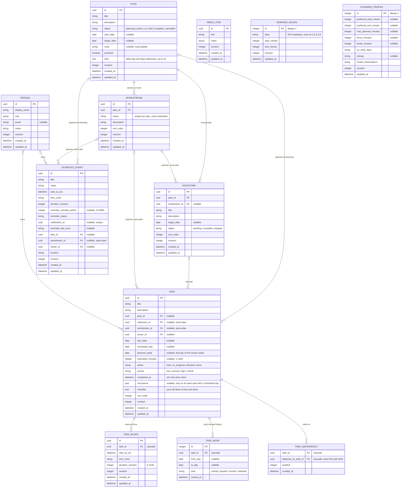

# Data model and storage

Delve Planner keeps everything on the device. Planner records live in one SQLite database, other apps' calendars live in a second one, and secrets live in the operating system's credential store. This document describes what each store holds, how records relate, and the rules that keep them consistent.

## Where data lives

| Store                                               | Location                                    | Holds                                                                                                                               | Exported | Backed up |
| --------------------------------------------------- | ------------------------------------------- | ----------------------------------------------------------------------------------------------------------------------------------- | -------- | --------- |
| `dayplan.sqlite3`                                   | App data directory                          | Plans, workstreams, milestones, tasks, events, people, inbox, time blocks, working hours, profile                                   | Partly¹  | Yes       |
| `backups/dayplan-v<schema>-<time>-<reason>.sqlite3` | App data directory                          | Copies of the planner database taken before migrations, imports, and restores (newest five kept)                                    | —        | —         |
| `calendars.sqlite3`                                 | App data directory                          | Subscribed and connected calendars, accounts, cached occurrences, last fetched iCalendar document                                   | No       | No        |
| `ai-models/`                                        | App data directory                          | Models Delve Planner downloaded itself                                                                                              | No       | No        |
| `ai-runtime.json`                                   | App data directory                          | The chosen model, models that passed the format check, and the running model server's process ID                                    | No       | No        |
| `shortcuts.json`                                    | App data directory                          | The system-wide quick-capture shortcut, if one is recorded                                                                          | No       | No        |
| Keychain items                                      | macOS Keychain / Windows Credential Manager | Calendar links and OAuth refresh tokens, one item each                                                                              | No       | No        |
| `dayplan*.log`                                      | App log directory                           | Redacted event codes such as `app_started` (see [privacy](privacy.md#logs-and-diagnostics))                                         | No       | No        |
| `localStorage`                                      | The app's WebView storage                   | UI conveniences only: onboarding done, dismissed planning prompts, kept time blocks, week start, and the Today and Week plan filter | No       | No        |

¹ Exports include people, plans, workstreams, milestones, events, tasks, inbox items, and time blocks. Working hours, the planning profile, and the carry-forward history are device preferences and are left out.

The app data directory is Tauri's `app_data_dir` for the bundle identifier `com.vonvan.dayplan.desktop`: `~/Library/Application Support/com.vonvan.dayplan.desktop/` on macOS and `%APPDATA%\com.vonvan.dayplan.desktop\` on Windows. The identifier and the `dayplan` file names above date from before the app was renamed from DayPlan, and they stay as they are so existing installs keep their data. The planner database runs in WAL mode with foreign keys enforced.

Why two databases: calendar data has a different owner and lifecycle from planner data. Keeping the cache in its own file means backups, restores, and imports never touch it, removing a calendar deletes everything cached for it, and losing the file loses only cached copies — the planner never depends on it. See [calendar integration](calendar-integration.md#data-ownership).

## Planner records

The Rust definitions are in [`src-tauri/src/model.rs`](../src-tauri/src/model.rs); the tables are created and migrated in [`src-tauri/src/db.rs`](../src-tauri/src/db.rs) and the modules under [`src-tauri/src/db/`](../src-tauri/src/db/). The renderer parses every record it receives with the strict Zod schemas in [`src/api.ts`](../src/api.ts).

### Plans, milestones, and workstreams

- A **plan** is a long-range container and may exist without dates. Items without a plan stay fully valid, so Delve Planner still works as a plain day planner. A plan can keep up to 20 titled links, each an `http` or `https` address that Rust opens in the browser by its position, so the renderer never hands an address to the system.
- **Templates** (Event, Trip, Move, Research or school project, Job search, Personal project) are defined in Rust and create a plan with a few starting workstreams in one transaction. **Duplicating** a plan copies its workstreams, milestones (as pending), and open tasks (as to-do, with checklists unticked and waits between copied tasks kept) into a new plan, moving every date by the same number of days; finished tasks, events, and time blocks stay with the original.
- A **milestone** is a checkpoint rather than work. Only user decisions (`pending`, `complete`, `skipped`) are stored; "upcoming" and "overdue" are derived from dates. Deleting a milestone keeps its tasks in the plan.
- A **workstream** is a named stream of work inside one plan, such as Production or Sponsors, with progress derived from its tasks.
- **Archiving** is the normal way to put a plan away: it hides the plan from navigation and keeps everything. A plan must be archived before it can be deleted. Deletion runs in one transaction and is previewed in the confirmation: the plan's workstreams, milestones, and tasks with no week, scheduled day, or due date are deleted, while its other tasks and all of its events stay on the calendar without a plan or workstream (their revisions advance). Owners stay assigned.

### Tasks and the Plan → Week → Today horizons

A **task** is work that needs doing, kept separate from a **schedule event** (a block of time). One task record moves between horizons; nothing is copied.

| State     | Field           | Meaning                                           |
| --------- | --------------- | ------------------------------------------------- |
| In a plan | `plan_id`       | Part of the plan's backlog                        |
| This week | `planned_week`  | Chosen for a week, with no day yet                |
| Scheduled | `scheduled_day` | To be worked on that day                          |
| Due       | `due_date`      | A deadline only; it never implies a week or a day |

- A task must have at least one of a plan, week, scheduled day, or due date, so it always appears somewhere. The rule is enforced in Rust ([`db/planning.rs`](../src-tauri/src/db/planning.rs), [`db/proposals.rs`](../src-tauri/src/db/proposals.rs)) and mirrored by `taskHasHome` in [`src/planning.ts`](../src/planning.ts).
- `planned_week` holds the first day of the chosen week and is matched by range, so a changed week start never orphans a choice.
- A task's milestone and workstream must belong to the task's plan.
- Every move between a plan, a week, and a day changes the same record, and a batch of moves applies in one revision-checked transaction. Nothing is rescheduled automatically; unfinished work from earlier days is offered for an explicit move.
- **Repeating tasks.** A repeat rule (daily, weekdays, weekly on chosen days, or monthly on a day, every 1–99 days, weeks, or months) lives on the task's one open occurrence, which needs a scheduled day. Marking it done creates the next occurrence — on the first rule date after both its day and today — in the same transaction, and moves the rule onto it, so finishing the same task twice can't create two. Skipping moves the open occurrence to its next date instead. A missed occurrence stays where it is, with unfinished work.
- **Checklists** are steps stored on the task itself, not tasks of their own.
- **Waits.** A task can wait on up to ten other tasks through `task_dependencies`. A wait is a hint shown beside the task and never blocks anything; waits that would form a cycle are refused, and deleting either task removes the link.
- **Carry-forward history.** When a task moves off a day it was already on, a `task_moves` row records the task's ID, the two days, the kind of move, and the moment. No title, notes, or other content is copied. Rows are removed with their task, cleared by **Forget the history behind these**, and — because importing replaces all tasks — cleared by an import. The history started empty in v0.3.5.

### Events, reminders, and time blocks

- **Schedule events** store their start in UTC alongside the IANA time zone they were created in, plus a duration. Day queries include events that overlap the selected day, not only those that start in it.
- **Reminders.** An event can have one reminder from its start time to seven days before. The offset, delivery status, an internal notification ID, and the last delivery error are columns on the event itself, written in the same transaction as the event: together they form a transactional outbox that a background worker reconciles and delivers (see [architecture](architecture.md#reminders)). Imports generate new notification IDs.
- A **time block** reserves time for a task, apart from events. A task can have several; moving or removing a block never changes the task, deleting the task deletes its blocks, and a finished task can't take a new one.

### People and the inbox

- A **person** is a local label for whoever owns a task or event — never an account. Deleting a person or workstream keeps their work and clears the link, advancing revisions.
- An **inbox item** is a capture with no plan, date, or priority. Converting it creates a task, plan, or event and removes the item in one transaction.

### Device preferences

- **Working hours** are one revision-checked record of working days and hours (Monday–Friday, 09:00–17:00 by default).
- The **planning profile** is one record whose fields all start empty: preferred hours, the most work to plan into a day, focus-block and break lengths, days off, and when demanding work suits the user, plus which observations are switched off. A day marked off holds no working time. The profile is used by capacity; the AI planner sees its days off and daily limit only inside the spare-time numbers it gets when asked to choose a day (see [AI](ai.md#what-the-model-sees)).
- The **quick-capture shortcut** and, in the WebView's storage, the **week start** and the Today and Week **plan filter** are kept per device and never exported.
- Observations (**What it noticed** on What Delve Planner knows) are computed from these records each time they are requested and are never stored. None is shown until at least five records support it. Blocked time counts on the local day it started, in the zone it was made in.

## Consistency rules

- **Revisions.** Every mutable record carries a `revision`. Updates and deletes name the revision they were based on and fail with a conflict if the record has changed since, so a stale manual edit or AI proposal can't overwrite newer data. Background calendar bookkeeping never bumps a calendar's revision.
- **Transactions.** Multi-record changes — plan deletion, inbox conversion, batched task moves, AI proposals, imports — run in one transaction and leave no partial state on failure.
- **Time.** Times are persisted in UTC with their IANA zone. A local time that a daylight saving change skips or repeats is never silently normalized: the UI and the AI planner ask which time was meant.
- **Validation lives in Rust.** Lengths, ranges, statuses, and cross-record links are checked in the repository layer; the renderer's Zod schemas guard the other direction, rejecting unexpected response shapes.

## Schema versions and migrations

The planner database schema is version 8 (`CURRENT_SCHEMA_VERSION` in [`db.rs`](../src-tauri/src/db.rs), stored in SQLite's `user_version`). Opening an older database checkpoints it, copies it to `backups/`, and migrates it in one transaction; a newer, unknown version is refused rather than guessed at. Each step is covered by a test that migrates a database from the previous shape.

| Schema | Adds                                                                                                                                                           |
| ------ | -------------------------------------------------------------------------------------------------------------------------------------------------------------- |
| 1      | Events and day-bound daily tasks                                                                                                                               |
| 2      | The reminder outbox columns on events                                                                                                                          |
| 3      | `plans` and `milestones`; events gain `plan_id`; every day-bound task moves into the general `tasks` table with `scheduled_day` set and a `done`/`todo` status |
| 4      | `people` and `workstreams`, owner and workstream links, event locations                                                                                        |
| 5      | `inbox_items`, and each task's `planned_week` and `estimated_minutes`                                                                                          |
| 6      | `task_blocks` and the `working_hours` record                                                                                                                   |
| 7      | The `planning_profile` record and the empty `task_moves` history                                                                                               |
| 8      | Each task's `recurrence` and `checklist`, the `task_dependencies` table, and each plan's `links`                                                               |

The calendar cache has its own, independent version (`STORE_VERSION` in [`calendar/store.rs`](../src-tauri/src/calendar/store.rs)).

## Export, import, backup, and restore

- **Export** writes a strict, versioned JSON file (format 7, which adds repeat rules, checklists, waits, and plan links). Formats 1–6 still import: older day tasks are upgraded the same way the migration upgrades them, and every cross-record link is checked before anything is replaced.
- **Import** parses and validates the whole file, shows a preview, and replaces planner data only after explicit confirmation — after taking a backup. Files over 50 MB, or with more than 100,000 records of any one kind, are refused. Calendars, working hours, and the planning profile are untouched.
- **Backups** are copies of the planner database taken before a migration, an import, or a restore. The newest five are kept.
- **Restore** checks a backup's integrity before swapping it in, and backs up the current database first.
- **Recovery.** A database that fails SQLite's integrity check at startup, or that a newer app version created, is left untouched: planner commands report the problem, and **Settings & recovery** lists the backups that can be restored.
- Application-level database encryption is not implemented; the files rely on OS account permissions and FileVault or BitLocker when enabled.
